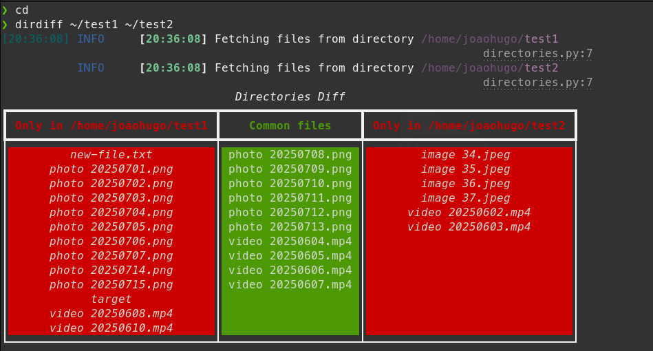

# dirdiff

CLI tool that prints out nicely the difference between two given directories.
This is a sandbox project that hasn't yet been deployed to any repository, so it is still necessary to build it locally. 


## Run Locally

Clone the project

```bash
  git clone https://github.com/jhugovasconcelos/dirdiff
```

Go to the project directory

```bash
  cd dirdiff
```

Install the build tool

```bash
  python3 -m pip install --upgrade build 
```

Build and install the app

```bash
  python3 -m build
  pip install dist/dirdiff-0.1.0-py3-none-any.whl
```

Test the command

```bash
  dirdiff --help
```

There is also a Dockerfile in the directory that can be used to build an image with the tool already installed for testing purposes.

## Screenshots




## Usage/Examples

For now, there are no flags, only two optional arguments that are passed to the command, the source directory and the destination directory, which are compared.

```bash
dirdiff <path/to/source/directory> <path/to/destination/directory>
```